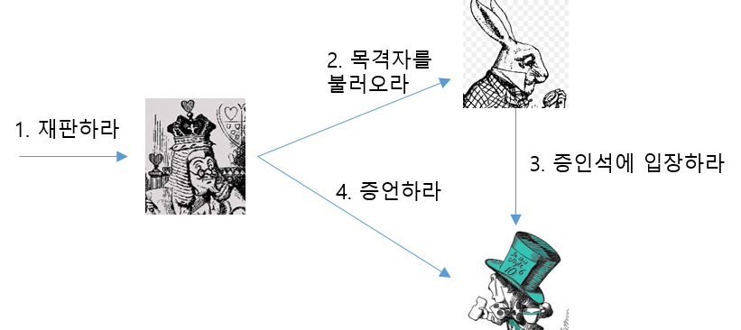
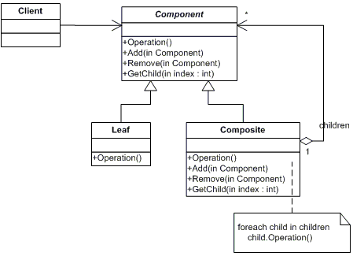

객체지향 세계에서는 협력이라는 문맥이 객체가 수행해야할 행동을 결정한다. 개별 객체가 아니라 객체 사이에 이뤄지는 협력이 중요하다. 협력이 자리 잡으면, 저절로 객체가 실행행해야하는 행동이 드러나고 뒤이어 객체가 갖고 있어야할 상태가 결정된다.

## 협력

#### 요청하고 응답하며 협력하는 사람들

**협력**은 한 사람이 다른 사람에게 도움을 **요청**할 때 시작된다. 자신에게 할당된 일을 처리하던 중에 스스로 해결하기 어려운 문제에 부딪히게 되면, 문제해결에 필요한 도움을 받을 수 있는 누군가에게 도움을 요청한다. 요청을 받은 사람은 요청자에게 필요한 지식을 알려주거나 서비스를 제공한다.

여기서 요청을 받은 사람 역시 자신에게 주어진 일을 처리하던 중에 다른 사람의 도움이 필요한 경우가 있다.

결과적으로 협력은 다수의 요청과 응답으로 구성되며, 전체적으로 협력은 다수의 연쇄적인 요청과 응답의 흐름으로 구성된다.

#### 누가 파이를 훔쳤지

이야기에 등장하는 객체들은 잭의 재판이라는 공동의 목적을 달성하기 위해 협력하고 있다.

- 누군가가 왕에게 재판을 요청한다. (1. 재판하라)
- 왕은 토끼에게 증인을 부를 것을 요청한다. (2. 목격자를 불러오라)
- 왕의 요청을 받은 토끼는 모자 장수에게 증인석으로 입장할 것을 요청한다. (3. 증인석에 입장하라)
- 모자 장수의 입장은 왕이 토끼에게 요청했던 증인 호출에 대한 응답이기도 하다.
- 이제 왕은 모자 장수에게 증언할 것을 요청한다. (4. 증언하라)
- 모자 장수는 자신이 알고 있는 내용을 증언함으로써 왕의 요청에 응답한다.

등장인물이 서로에게 요청하고 응답하며 협력하고 있다. 여러 요청과 응답의 연쇄가 재판과정을 구성하고 있다.

그런데 이야기에서 요청과 응답을 자세히 살펴 보면,

- 왕은 재판을 수행할 의무가 있고, 재판에 필요한 지식을 알고 있다. 
- 왕이 토끼에게 목격자를 불러오라고 요청한 이유는 왕은 토끼가 목격자에 대해 알고 있으며 동시에 목격자를 부를 의무가 있기 때문이다.
- 왕이 모자장수에게 증언하라고 요청한 이유는 모자 장수가 사건에 대해 알고 있으며 증언할 의무가 있기 때문이다.

결국 등장인물들이 특정한 요청을 받아들일 수 있는 이유는 그 요청에 대해 적절한 지식과 행동 방식을 갖고 있기 때문이다. 요청과 응답은 협력에 참여하는 객체가 수행해야할 책임을 정의한다.

### 책임

객체지향 세계에서는 객체가 어떤 요청에 대해 대답해 줄 수 있거나, 적절한 행동을 할 의무가 있는 경우 해당 객체가 **책임**을 가진다고 말한다.

앞선 이야기에서 왕은 '재판을 수행하라'는 요청에 응답해야 하므로 '재판을 수행할' 의무가 있고, 토끼는 '목격자를 불러오라'는 요청에 적절히 응답해야 하므로 '목격자를 불러올' 책임을 지고 있다.

<u>결국 어떤 대상에 대한 요청은 그 대상이 요청을 처리할 책임이 있음을 암시한다.</u>

'객체지향 개발에서 가장 중요한 능력은 책임을 능숙하게 소프트웨어 객체에 할당하는 것'[Larman 2004]. 책임을 어떻게 구현할 것인가 하는 문제는 객체와 책임이 제자리를 잡은 후에 고려해도 늦지 않다.

#### 책임의 분류

책임은 객체에 의해 정의되는 응집도 있는 행위의 집합이다. 객체가 알아야 하는 정보와 객체가 수행할 수 있는 행위에 대해 개략적으로 서술한 문장이다.

객체의 책임을 크게 '하는 것'과 '아는 것'의 두 가지 범주로 자세히 분류하고 있다.

* 하는 것 (doing)

    * 객체를 생성하거나 계산을 하는 등 스스로 하는 것
    * 다른 객체의 행동을 시작시키는 것
    * 다른 객체의 활동을 제어하고 조절하는 것

* 아는 것 (knowing)

    * 개인적인 정보에 관해 아는 것
    * 관련된 객체에 관해 아는 것
    * 자신이 유도하거나 계산할 수 있는 것에 관해 아는 것

책임은 객체의 외부에 제공해 줄 수 있는 정보(아는 것)와 외부에 제공해 줄 수 있는 서비스(하는 것)의 목록이다.

#### 책임과 메시지

객체는 요청이 전송됐을 경우에만 자신에게 주어진 책임을 수행한다. 이렇게 요청을 보내는 것을 **메시지 전송 message-send**이라고 한다. 요청하는 객체를 메시지 **송신자**라고 하고 요청을 처리하는 객체를 메시지 **수신자**라고 한다.

책임이 협력이라는 문맥 속에서 요청을 수신하는 한 쪽의 객체 관점에서 무엇을 할 수 있는지 나열한 것이라면, 메시지는 협력에 참여하는 두 객체 사이의 관계를 강조한 것이다.

메시지는 책임을 의마한다. 하지만 한 가지 주의할 점은 책임과 메시지의 수준이 같지는 않다는 점이다. 책임은 수행햐아하는 행위를 상위수준에서 개략적으로 서술한 것이다. 책임을 결정한 후 이를 메시지로 변환할 때는 하나의 책임이 여러 메시지로 분할되는 것이 일반적이다.

설계를 시작하는 초반에는 어떤 객체가 어떤 책임을 가지고 어떤 방식으로 서로 협력해야 하는지에 대한 개요를 파악하는 것으로 충분하다. 책임과 협력이 자리 잡은 후에 책임을 구현하는 방법을 고민하기 시작하면 된다.

어떤 클래스가 필요하고 어떤 메서드를 포함해야 하는지를 결정하는 것은 책임과 메시지에 대한 대략적인 윤곽을 잡은 후에 시작해도 늦지 않다. "증언하라"라는 메시지를 송수신할 수 있다는 것을 결정하고 어떻게 증언할 것인지는 나중에 결정해도 된다.

### 역할

협력의 관점에서 어떤 객체가 어떤 책임 집합을 수행한다는 것이 무엇을 의미하는지 생각해 보자. 왕은 "재판한다"와 "증인을 불러 오도록 요청한다." "증인에게 증언하도록 요구한다"는 책임을 지고 있다. **왕은 '판사'라는 역할을 수행하고 있음을 의미한다.**

#### 판사와 증인

이야기에서 '판사'역할은 왕이 수행했지만, 수행이 가능하다면 다른 등장인물이 역할을 맡을 수도 있다. 역할은 책임의 집합이고, 이 책임 집합을 모두 수행할 수 있다면 이 역할을 여려 타입의 객체가 역할을 맡아 수행할 수도 있다.

#### 역할이 답이다.

역할을 사용하면 객체 없이 협력을 단순화 하여 추상화 할 수 있다. 역할은 협력 내에서 다른 객체로 대체할 수 있음을 나타내는 일종의 표식이다. 협력안에서 역할은 "이 자리는 해당 역할을 수행할 수 있는 어떤 객체라도 대신할 수 있습니다."라고 말하는 것과 같다.

동일한 역할을 수행하는 객체들이 동일한 메시지를 수신할 수 있기 때문에 동일한 책임을 수행할 수 있다는 것은 매우 중요한 개념이다. 이 개념을 제대로 이해해야만 객체지향이 제공하는 많은 장점을 누릴 수 있다.

역할을 대체할 수 있는 객체는 동일한 메시지를 이해할 수 있는 객체로 한정된다.

요약하면 역할의 개념을 사용하면 유사한 협력을 추상화해서 인지 과부하를 줄일 수 있다. 또한 다양한 객체들이 협력에 참여할 수 있기 때문에 협력이 좀 더 유연해지며 다양한 객체가 참여할 수 있는 만큼 재사용성이 높아진다. 역할은 객체지향 설계의 **단순성, 유연성, 재사용성**을 뒷받침하는 핵심 개념이다.

코드에서는 정해진 메시지(책임으로) 협력하던 객체들이, 실제 객체가 아닌 인터페이스를 통해 협력을 추상화 할 수 있다는 것이다. 인터페이스로 추상화 역할을 구현체인 객체가 수행할 수 있어 유연성 등이 증가 된다는 것. 역할은 협력의 추상화!

#### 협력의 추상화

역할은 하나의 협력 안에 여러 종류의 객체가 참여할 수 있게 함으로써 협력을 **추상화**할 수 있다는 것이다. 협력의 추상화는 협력의 개수를 줄이고, 구체적인 객체를 추상적인 역할로 대체하여 협력의 양상을 단순화 한다. 결과적으로 어플리케여선의 설계를 이해하고 기억하기 쉬워진다.

#### 대체 가능성

역할은 협력 안에서 구체적인 객체로 대체될 수 있는 추상적인 협력자다. 따라서 본질적으로 역할은 다른 객체에 의해 **대체 가능함**을 의미한다.

객체가 역할을 대체하기 위해서는 행동이 호환되야 한다. *객체가 역할을 대체 가능하기 위해서는 협력 안에서 역할이 수행하는 모든 책임을 동일하게 수행할 수 있어야 한다.*

앨리스가 판사일 수도 있고, 주인공 일 수도 있다. 따라서 구현체인 객체는 역할이 암시하는 책임보다 더 많은 책임을 가질 수 있다. 따라서 객체의 타입과 역할 사이에는 **일반화/특수화 관게**가 성립하는 것이 일반적이다. 역할이 협력을 추상적으로 만들 수 있는 이유는 역할 자체가 객체의 추상화이기 때문이다.

요약하면 역할의 대체 가능성은 행위 호완성을 의미하고, 행위 호완성은 동일한 책임의 수행을 의미한다.

### 객체의 모양을 결정하는 협력

### 흔한 오류

데이터를 디스크에 저장하기 위해 객체가 존재한다는 선입견을 가지고 있다. 하지만 데이터는 객체가 행위를 수행하는데 필요한 재료일 뿐이다. 객체가 존재하는 이유는 행위를 수행하며 협력에 참여하기 위해서다. 따라서 중요한 것은 객체의 행동, 즉 책임이다.

두번째 선입견은 객체지향이 클래스와 클래스 간의 관계를 표현하는 시스템의 정적인 측면에서 중점을 둔다는 것이다. 중요한 것은 정적인 클래스가 아니라 협력에 참여하는 동적인 객체다. 클래스는 단지 객체를 표현하고 생성하기 위한 프로그램 언어의 syntax다.

객체를 협력이라는 문맥에서 떼어놓은 채 어떤 데이터가 필요하고 어떤 클래스로 구현해야 하는 지를 고민하는 것이 아무런 도움이 되지 않는다.

#### 협력을 따라 흐르는 객체의 책임

**올바른 객체를 설계하기 위해서는 먼저 견고하고 깔끔한 협력을 설게해야 한다. 협력을 설계한다는 것은 설계에 참여하는 객체들이 주고받을 요청과 응답의 흐름을 결정한다는 것을 의미한다.** 이렇게 결정된 요청과 응답의 흐름은 객체가 협력에 참여하기 위해 수행될 책임이 된다. 

일단 객체에게 책임을 할당하고 나면 책임은 객체가 외부에 제공하게 될 행동이 된다. 협력 안에서 객체가 수행하게 될 적절한 책임, 즉 행동을 결정한 후에 그 행동을 수행하는 데 필요한 데이터를 고민해야 한다.

클래스는 데이터와 행위가 결정된 뒤에야 클래스 구현방법을 결정해야 한다. 협력을 구성하는데 필요한 일련의 책임을 고안하고 난뒤 그 책임을 수행하는 데 필요한 객체를 선택하게 된다. 

어떤 책임은 왕에게, 어떤 책임은 토끼에게 각 객체에 책임을 부여한다. 책임을 부여하면 객체들이 외부에 제공하게 될 행동을 정의하게 된다. 행동이 결정 됐으니 각 객체가 필요로 하는 데이터를 정의할 수 있따.

순서는 협력 (->) 책임 -> 책임의 객체할당(=외부 제공 행동) -> 데이터 -> 클래스

협력에 필요한 책임을 결정하고, 객체에게 책임을 할당하는 과정을 얼마나 합리적이고 적절하게 수행했는지가 객체지향 설계의 품질을 결정한다. (=객체지향 설계의 핵심은 올바른 책임을 올바른 객체에게 할당하는 것이다.)

### 객체지향 설계 기법

1. 책임-주도 설계 Responsibility-Driven Design

    위에 나온 방법과 같다. 협력과 책임을 식별하고, 객체에게 책임을 할당하는 방식으로 어플리케이션을 설계한다.

    UML을 그린다고 해서 좋은 객체지향 시스템이 보장되는 것은 아니다. 전체 개발 단계에 걸쳐 객체의 역할과 책임, 협력을 도드라지게 만드는 기법과 체계를 따르는 것이 중요하다. 객체지향 시스템을 창조하는 작업은 지속적인 훈련과 견고한 기술, 안정적인 가이드라인을 필요로 한다.

    객체지형 설계 방법은 *레베카 워프스브록의 책임-주도 설계 방법[Wirfs-Brock 2003]*이 가장 널리 받아 들여지고 있다.

    RDD 시스템 설계 절차

    * 시스템이 사용자에게 제공해야 하는 기능인 시스템 책임을 파악한다.
    * 시스템 책임을 더 작은 책임으로 분할한다.
    * 분할된 책임을 수행할 수 있는 적절한 객체 또는 역할을 찾아 책임을 할당한다.
    * 객체가 책임을 수행하는 중에 다른 객체의 도움이 필요한 경우 이를 책임질 적절한 객체 또는 역할을 찾는다.
    * 해당 객체 또는 역할에게 책임을 할당함으로써 두 객체가 협력하게 한다.

2. 디자인 패턴

    전문가들이 반복적으로 사용하는 해결 방법을 정의해 놓은 **설계 템플릿** 모음이다. 특정 문제를 해결하기 위해 이미 식별해 놓은 **역할, 책임, 협력의 모음**이다.

    RDD가 방법과 절차라면 디자인 패턴은 RDD의 결과다.

    디자인 패턴은 반복적으로 발생하는 문제와 그 문제에 대한 해법의 쌍으로 정의된다. 패턴은 해결하려고 하는 문제가 무엇인지를 명확하게 서술하고, 패턴을 적용할 수 있는 상황과 적용할 수 없는 상황을 함께 설명한다.
    
    패턴은 특정 상황에서 어떤 설계가 왜 더 효과적인지에 대한 이유를 설명한다.

    디자인 패턴의 한가지 예로 COMPOSITE 패턴을 살펴보자.

    COMPOSITE 패턴은 전체와 부분을 하나의 단위로 추상화해야 하는 경우에 사용할 수 있는 패턴이다. 파일 시스템에 이 패턴을 적용할 수 있다. "cp"나 "mv"는 대상이 파일이어도, 디렉토리여도 상관없이 똑같이 동작한다. COMPOSITE 패턴은 이처럼 클라이언트 입장에서 메시지 수신자가 부분(파일)인지 전체(디렉토리)인지에 상관 없이 동일한 메시지(cp나 mv)를 이용해 동일한 방식으로 상호작용하고 싶을 떄 사용할 수 있는 패턴이다.

    

    **중요한 것은 그림에 표현돼 있는 구성 요소가 클래스와 메서드가 아니라 '협력'에 참여하는 '역할'과 '책임'이라는 사실이다.** Component는 클라이언트와 협력할 수 있는 공용 인터페이스를 정의하는 역할을 수행한다. Leaf는 Component에 대한 Operation호출에 응답할 수 있는 기본적인 행위를 구현한다. Composite은 외부로 부터 부분에 대한 세부 사항을 감추고 포함된 부분을 하나의 단위로 행동하는 역할이다.

    COMPOSITE 패턴은 부분과 전체가 투명하고 동일한 인터페이스를 제공해야 한다는 제약하에서 역할, 책임, 협력을 제공하는 한 가지 설계 예제다.

    Component, Leaf, Composite이 역할이라는 사실은 실제로 구현 시에는 다양한 방식으로 역할을 구현할 수 있다는 사실을 암시한다. 심지어 하나의 객체가 세가지 역할을 모두 수행할 수도 있다.

    

    이 COMPOSITE 패턴에 대한 책의 설명과 이전에 COMPOSITE 패턴을 활용하려고 했던 경험 덕분에 디자인 패턴이 무엇인지 확실히 알게 되었다. ㅜㅜ
    
    글에 대한 카테고리 트리를 구현하려고 했을 때 참조하려고 했던 패턴이 COMPOSITE 패턴이었다. 파일 시스템이라는 대표적인 트리 구조처럼 카테고리를 트리 구조로 구현하려 했고, COMPOSITE 패턴이 필요하다 생각되어 적용하려 했었다.

    적용할 때 Leaf는 파일 처럼 트리의 종단 노드를, Composite은 자식이 있는 노드로 가정하고 구현을 진행했다.

    진행하다보니 Leaf와 Composite의 구현체를 나누는 의미가 없는 것 처럼 느껴졌다. 노드의 CRUD만 구현 했었는데, "노드에 자식을 추가" "부모가 삭제되면 자식도 삭제" "노드의 이름을 수정" 세가지 행위만 있었기 때문에 Leaf와 Composite이 구분이 필요하기보다, 자식이 있는지 없는 지만 구분하면 되었다. 이 노드가 종단인지, 종단이 아닌지는 자식이 있는지 없는지에 따라 결정되고, 노드는 노드일 뿐 종단인지 줄기인지를 클래스로 구분할 필요는 없었기 때문이다.

    책에서도 나온 Leaf와 Composite과 Component를 하나의 객체(클래스)로 합친 조슈아 케리에브스키의 변형된 COMPOSITE 패턴은, 최종적으로 내가 구현한 트리의 모습이 되었다.

    핵심은 디자인 패턴의 인터페이스와 클래스 들은 **"역할, 책임, 협력"**의 템플릿이란 것이다. 나는 Leaf와 Composite을 하나로 합쳐서 Node를 만들었지만, 트리 자체가 다른 객체와 협력하거나, 성능 이슈 등 다른 원인으로 Leaf와 Composite의 타입을 구분하여 별도의 객체나 인터페이스로 만들어야 하는 이유가 있을 수도 있다. 패턴은 반복적으로 발생하는 문제의 대충의 해법 같은 것이고 변형되어 적용되는 것이 당연하기 때문이다.

    디자인 패턴을 사용하는 사람의 입장에서 디자인 패턴의 해석 은, 먼저 '객오사'에서 말 한 것 처럼 디자인 패턴의 협력관계를 파악하는 것이다. 다이어그램의 협력을 파악하는 것이 먼저다. 일전에 카테고리 트리에 COMPOSITE 패턴을 적용하려고 했을 때, 나는 트리의 종말 Node를 Leaf, 줄기 Node를 Compoiste에 상응한다는 이상한 전제를 기반으로 구현하기 시작했기 때문에 삽질을 한 것이다. 내가 만들고자 했던 카테고리 트리의 협력에서는 Leaf와 Composite, Component의 협력, 책임 구조가 필요 없었는데, 다이어그램의 모양새만 보고 구현에 적용하려고 했기 때문에 혼란이 있었던 것이다.

    패턴을 적용할 때는 패턴을 변형하여 적용시키는 것이 당연하다. 건축가 알렉산더는 "모든 패턴은 우리의 환경에서 반복적으로 발생하는 문제를 설명하며, 이 문제에 대해 수백만 번이라도 반복해서 적용할 수 있지만 매번 다른 방법으로 적용할 수 있는 해결책의 핵심을 설명 하는 것이다."라고 했다. "대충 이렇게 될 것 같은데"라는 대충 주어진 해법으로 디자인 패턴을 바라보고, 실제 문제의 해결은 알맞게 변형된 패턴을 사용하는 것이 맞다.

    

3. TDD

    흔히 알려진 바로 TDD는 테스트를 먼저 작성하고 테스트를 통과하는 구체적인 코드를 추가하면서 어플리케이션을 완성해가는 방법이다. TDD의 핵심은 테스트 작성이 아니다. 테스트를 통해 코드 변경시의 리스크를 줄이는 이점은 보너스일 뿐이다.

    책임을 수행할 객체 또는 클라이언트가 기대하는 객체의 역할이 메시지를 수신할 때 어떤 결과를 반환하고 그 과정에서 어떤 객체와 협력할 것인지에 대한 기대를 코드의 형태로 작성하는 것이다.

    RDD 설계를 통해 도달해야하는 목적지를 테스트라는 안전장치를 통해 좀 더 빠르고 견고한 방법으로 도달할 수 있도록 해주는 최상의 설계 프랙티스다.

    TDD는 객체지향에 대한 깊이 있는 지식을 요구한다. 테스트를 작성하기 위해 객체의 메서드를 호출하고 반환값을 검증하는 것은 순간적으로 객체가 수행해야하는 책임에 관해 생각한 것이다. 테스트에 필요한 간접 입력 값을 제공하기 위해 stub을 추가하거나 간접 출력 값을 검증하기 위해 목 객체(mock object)를 사용하는 것은 객체와 협력해야 하는 협력자에 관해 고민한 결과를 코드로 표현한 것이다.

