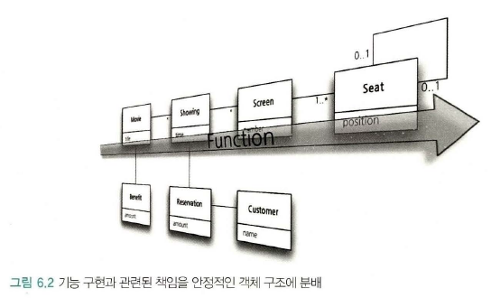
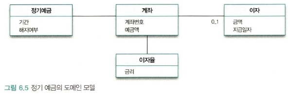
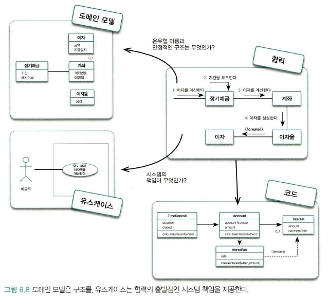
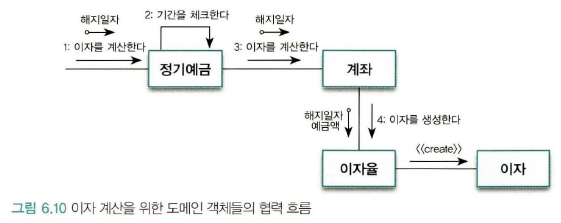
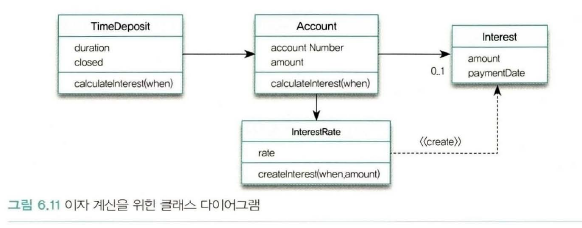
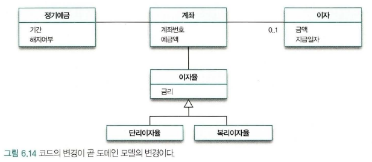

#### 길 찾기

길을 찾는 방법은 두가지다.

1. 지나가는 사람에게 마을 까지 가는 길을 직접 물어 보는 것

    "이 길을 따라 5km 직진하면 강이 나오는데 강을 건너지 말고 강둑을 따라 남쪽으로 2km 이동하세요. 그러면 작은 야산이 한 ㅏ나오는데 약수터 가는 길을 따라 산을 넘으면 그 마을이 나옵니다."

    * 기능적이고 해결책 지향적인 접근법functional, solution-directed approach

    * 길을 알려준 사람이 올바른 길을 알려 주었고, 알려준 길을 올바르게 따른다면 마을로 이동할 수 있다. 그러나 강이나 산과 같은 중요한 랜드마크가 없다면 경로를 설명하기 어렵고, 설명만으로 경로를 찾기도 쉽지 않다.

2. 지도에 표시된 길을 따라가는 방법

    현재위치와 가고자 하는 마을을 지도에서 찾고 마을 사이에 나 있는 길을 따라 연결하기만 하면 된다.

    * 지도는 실세계의 지형을 기반으로 만들어진 추상화된 모델이다. 지도에는 길을 찾는데 필요한 풍부한 컨텍스트 정보가 함축돼 있다.

    * 모든 정보가 지도안에 포함돼 있기 때문에 강과 같은 특정한 랜드마크를 이용해 길을 설명할 필요가 없다. 지도는 길을 찾는데 필요한 주변 지형을 추상적으로 표현하고 있기 때문에 실세계의 환경과 우리의 지식을 밀접하게 연관지을 수 있게 해준다.

    * 구조적이고 문제 지향적인 접근법 (structural, problem-directed approach)

    * 지도는 길을 찾는데 필요한 구체적인 기능이 아니라 길을 찾을 수 있는 '구조'를 제공한다.

    * 첫 번째 방법은 목적지가 변경되는 등 요구사항이 바뀌면 이전의 지시를 사용하기 힘들다.

    * 하지만 지도는 범용적으로 사용할 수 있다. 다른 장소를 찾는데 지도를 재사용할 수 있다. 같은 목적지로 가는 다른 경로를 찾을 수도 있다.

    * 지도가 범용적인 이유는 지도를 사요하려는 사람들이 원하는 '기능'에 비해 지도에 표시된 '구조'가 더 안정적이기 떄문이다.

    * 또 흥미로운 사실은 지형은 거의 변하지 않기 때문에 과거의 지도가 현재에도 여전히 유용하게 사용될 수 있다는 것이다.

**지도의 은유가 시사하는 바는 기능이 아니라 구조를 기반으로 모델을 구축하는 편이 좀 더 범용적이고 이해하기 쉬워며 변경에 안정적이라는 것이다.** 자주 변경되는 기능이 아니라 안정적인 구조를 따라 역할, 책임, 협력을 구성하라는 것이 이번 장의 주제다.

### 기능 설계 대 구조 설계

소프트웨어 제품의 설계에는 두 가지 측면이 존재한다.

* 기능 측면의 설계 : 제품이 사용자를 위해 무엇을 할 수 있는지에 초점을 맞춘다.

* 구조적 축면의 설계 : 제품의 형태가 어떠해야 하는지에 초점을 맞춘다.

설계는 기능과 구조라는 두 가지 측면을 함께 녹여 조화를 이루도록 만드는 것이 가장 큰 도전 과제다.

좋은 소프트웨어는 먼저 좋은 기능을 제공해야 한다. 성공적인 소프트웨어들이 지닌 공통적인 특징은 훌륭한 기능을 제공하는 동시에 사용자가 원하는 새로운 기능을 빠르고 안정적으로 추가할 수 있다는 것이다.

요구사항이 변경되지 않는다면 구조는 중요하지 않다. 불행히도 소프트웨어 분야에서 예외가 없는 유일한 규칙은 요구사항이 항상 변경된다는 것이다. 요구사항은 예측 불가능하게 변경된다.

훌륭한 설계자는 훌륭한 기능을 제공하는 동시에, 예측 불가능한 요구사항 변경에 유연하게 대처할 수 있는 안정적인 구조를 제공하는 능력을 갖춰야 한다.

미래의 변경에 대비할 수는 있지만 미래의 변경을 예측할 수는 없다. *불확실한 미래의 변경을 예측하고 이를 성급하게 설계에 반영하는 것은 불필요하게 복잡한 설계를 낳을 뿐이다.*

미래를 대비하는 가장 좋은 방법은 변경을 예측하는 것이 아니라 변경을 수용할 수 있는 선택의 여지를 설계에 미리 마련해 놓는 것이다. 좋은 설계는 나중에라도 변경할 수 있는 여지를 남겨 놓는 설계다. 여지를 남는 가장 좋은 방법은 자주 변경되는 기능이 아닌 안정적인 구조를 중심으로 설계하는 것이다.

기능 분해functional decoposition은 자주 변경되는 기능을 중심으로 설계한 후 구조가 기능에 따르게 한다. 이 방법을 사용한 설계는 시스템 기능을 분해한다. 그리고 각 기능이 '밀접하게' 관련된 하나의 덩어리를 이루기 때문에 기능이 변경될 경우 기능의 축을 따라 설계된 소프트웨어가 전체적으로 요동치게 된다.

반면에 객체지향 접근법은 자주 변경되지 않는 안정적인 객체 구조를 바탕으로 시스템 기능을 객체 간의 책임으로 분배한다. 기능이 변경되도 구조는 유지되어 소프트웨어를 유연하게 변경할 수 있다.

사람들에게 길을 묻지마라, 객체를 이용해 지도를 만들어라 기능은 지도에 표시된 길을 따라 자연스럽게 흘러갈 것이다.




### 두가지 재료 기능과 구조

객체지향 세계를 구축하기 위해서 '기능'과 '구조'라는 재료가 준비돼 있어야 한다. *(정확하게는 비기능적 요구사항이라는 또 다른 범주의 요구사항도 필요하다. 비기능적 요구사항은 사용용이성, 신뢰성, 성능 등과 기능외에 관련된 요구사항을 포함한다. 비기능적 요구사항은 시스템의 아키텍처에 영향을 미친다.)*

이 재료를 어디서 구할까. 객체지향 개발에 관한 과거 경험과 연구에서, 기능과 구조를 표현하기 위해 일관되게 적용할 수 있는 두 가지 기법을 발견했다.

* 구조는 사용자나 이해관계자들이 도메인(domain)에 관해 생각하는 개념과 개념들 간의 관계로 표현한다. -> 도메인 모델링, 도메인 모델

* 기능은 사용자의 목표를 만족시키기 위해 책임을 수행하는 시스템의 행위로 표현한다. -> 유스케이스 모델링, 유스케이스

### 안정적인 재료 : 구조

#### 도메인 모델

도메인은 사용자가 프로그램을 사용하는 대상 분야다.

모델은 대상을 단순화해서 표현한 것이다. 모델은 지식을 선택적으로 단순화하고 의식적으로 구조화한 형태다. 중요한 문제에 집중할 수 있도록 필요한 지식만 재구성한 것이다. 즉 대상을 추상화하고 단순화 한 것이다.

그래서 도메인+모델은 소프트웨어가 목적하는 영역 내의 개념과 개념 간의 관계, 다양한 규칙이나 제약 등을 주의 깊게 추상화 한 것이다.

도메인 모델은 이해관계자들이 바라보는 멘탈 모델 mental model이다. 멘탈 모델이란 사람들이 자기 자신, 다른 사람, 환경, 자신이 상호작용하는 사물들에 대해 갖는 모형이다. 사람들은 세상에 발생하는 현상을 이해하고 반응하기 위해 자신의 마음 속에 멘탈 모델을 구축한다.

도메인 모델은 사용자 머릿속에 사용자 모델, 설계자의 디자인 모델, 제품의 시스템이미지를 포괄하도록 추상화한 모델이다. 소프트웨어에 대한 멘탈 모델이다.



#### 도메인 모습을 담을 수 있는 객체지향

객체지향을 사용하면 사용자들이 이해하고 있는 도메인의 구조와 최대한 유사하게 코드를 구조화할 수 있다. 객체지향을 이용하면 도메인에 대한 사용자 모델, 디자인 모델, 시스템 이미지 모두가 유사한 모습을 유지하도록 만드는 것이 가능하다.

객체지향의 이런 특징을 **연결 완전성** 또는 **표현적 차이**라고 한다.

#### 표현적 차이

소프트 웨어 객체는 현실 객체에 대한 추상화가 아니다. 은유를 기반으로 재창조 한 것이다. 그래서 소프트 웨어 객체는 현실 객체와 달라진다.

다른 특징이 있지만 현실 객체의 특성을 토대로 구축된다. 이 때 발생하는 소프트웨어 객체와 현실 객체 사이의 의미적 거리를 표현적  차이 또는 의미적 차이라고 한다.

은유를 통해 투영해야하는 대상은 사용자가 도메인에 대해 생각하는 개념이다. 은유해야 하는 대상은 도메인 모델이다.

소프트 웨어 객체는 그 대상이 현실적인지, 현실적이지 않은지에 상관없이 도메인 모델을 통해 표현되는 도메인 객체들을 은유해야 한다.

도메인 모델을 기반으로 설계하고 구현하는 것은 사용자가 도메인을 바라보는 관점을 그대로 코드에 반영할 수 있게 한다. 이리 하면 표현의 차이가 줄어든다. 멘탈 모델이 코드에 스며들게 된다.

#### 불안정한 기능을 담는 안정적인 모델

도메인 모델이 제공하는 구조는 상대적으로 안정적이다. 사용자들은 누구보다도 도메인의 '본질적인' 측면을 가장 잘 이해하고 있다. 본질적이라는 것은 변경이 적고 비교적 그 특성이 오랜 시간 유지된다는 것을 의미한다. 변경될 확률이 적다.

이는 도메인 모델이 기능을 담을 수 있는 안정적인 구조를 제공할 수 있다는 것을 의미한다.

결론적으로 도메인 모델을 기반으로 소프트웨어 구조를 설계하면 변경에 유연하게 대응할 수 있는 탄력적인 소프트웨어를 만들 수 있다. 도메인 모델은 기능을 구현할 때 참조할 수 있는 궁극적인 지도다.

### 불안정한 재료: 기능

#### 유스케이스

**기능적 요구사항**은 사용자들이 시스템을 통해 달성하고자 하는 목표를 위해 존재한다. 따라서 훌륭한 요구사항을 얻기 위해서는 시스템과 사용자의 '상호작용' 관점에서 시스템을 바라봐야한다.

**상호작용**은 사용자가 시스템에 작업을 요청하고, 시스템이 요청을 처리하여 응답하는 것이다. 사용자는 한 번만 요청하는 것이 아니고, 시스템의 응답을 기반으로 다시 요청하기도 한다. 사용자-시스템 상호작용은 목표를 달성 할 때 까지 계속된다.

**유스케이스**는 사용자의 목표를 달성하기 위해 사용자와 시스템 간에 이뤄지는 상호작용의 흐름을 텍스트로 정리한 것을 유스케이스라고 한다. 엘리스터 코어번은 유스케이스를 다음과 같이 설명한다[Cockburn 2000].

```
유스케이스는 시스템의 이해관계자들 간의 계약을 행위 중심으로 파악한다. 유스케이스는 이해관계자들 중에서 일차 액터라 불리는 행위자 요청에 대한 시스템의 응답으로서, 다양한 조건하에 있는 시스템의 행위를 서술한다. 일차 액터는 어떤 목표를 달성하기 위해 시스템과의 상호작용을 시작한다. 시스템은 모든 이해관게자들의 요구에 응답하고 이해관계를 보호해야 한다. 특별한 요청과 관계되는 조건에 따라 서로 다른 일련의 행위 혹은 시나리오가 전개될 수 있다. 유스케이스는 이렇게 서로 다른 시나리오를 묶어 준다.
```

위에서 일차 액터 primary actor란 시스템의 서비스 중 하나를 요청하는 이해관계자다.

유스케이스의 가치는 사용자들의 **목표를 중심으로 시스템의 기능적인 요구사항을 이야기 형식으로 묶을 수 있다**는 점이다.

"유스케이스의 핵심은 사용자 목표다. 유스케이스는 공통의 사용자 목표를 통해 강하게 연관된 시나리오의 집합이다."[Fowler 2003]

* 산발적으로 흩어져있는 기능에 사용자 목표라는 문맥을 제공함으로써 각 기능이 유기적인 관계를 지닌 체계를 이룰 수 있게 한다.

* 유기적인 관계를 치닌 체계가 생겨 요구사항을 기억하고 관리하는 데 필요한 다양한 정신적 과부하를 줄인다.

`예제 - 간단한 이자액 계산 유스케이스`
```
유스케이스명: 중도 해지 이자액을 계산한다.

일차 액터: 예금주

주요 성공 시나리오:
1. 예금주가 정기예금 계좌를 선택한다.
2. 시스템은 정기예금 계좌 정보를 보여준다.
3. 예금주가 금일 기준으로 예금을 해지할 경우 지급받을 수 있는 이자 계산을 요청한다.
4. 시스템은 중도 해지 시 지급받을 수 있는 이자를 계산한 후 결과를 사용자에게 제공한다.

확장:
3a. 사용자는 해지 일자를 다른 일자로 입력할 수 있다.
```

#### 유스케이스의 특성

1. 유스케이스는 사용자와 시스템 간의 상호작용을 보여주는 '텍스트'다.

    중요한 것은 유스케이스 안에 포함되어 있는 상호작용 흐름과 유스케이스에 담겨 있는 이야기다. 다이어그램으로 부터 얻을 수 있는 것은 거의 없다.

2. 유스케이스는 하나의 시나리오가 아니라 여러 시나리오들의 집합이다. 
    
    **시나리오**는 유스케이스를 통해 시스템을 사용하는 하나의 특정한 이야기 또는 경로다.
    
    위 예제는 "예금주가 계좌를 선택하고 당일 까지의 이자액을 계산하는 것"과 "예금주가 계좌를 선택하고 특정 일자 까지의 이자액을 계산하는 것"이라는 2개의 시나리오를 포함하고 있다. 예제로부터 유스케이스는 하나의 시나리오가 아니라 이자액 계산이라는 사용자의 목표와 관련된 모든 시나리의 집합(유스케이스 인스턴스)이라는 사실을 알 수 있다.

3. 유스케이스는 단순한 피처 feature 목록과 다르다.

    피처는 기능의 목록이다. 유스케이스에서 피처는 '시스템은 정기에금 정보를 보여준다'와 '시스템은 당일이나 현재 일자의 이자릴 계산한다'이다. 피처의 단점은 이 두 피처를 서로 연관이 없는 독립적인 기능으로 보이게끔 만든다는 점이다.

    유스케이스는 두 피처를 묶어 이야기를 제공함으로써 시스템의 기능에 대해 의사소통할 수 있는 문맥을 제공한다.

4. 유스케이스는 UI와 관련된 세부 정보를 포함하지 말아야한다.

    UI요소는 배제하고 사용자 관점에서 시스템 행위에 초점을 맞춘다. 이와 같은 유스케이스 형식을 본질적인 유스케이스 essential use case라고 한다.

5. 유스케이스는 내부 설계와 관련된 정보를 포함하지 않는다.

    **유스케이스는 설계 기법도 객체지향 기법도 아니다.** 유스케이스는 단지 정리 기법이다.
    
    유스케이스와 객체의 구조 사이에는 큰 간격이 있다. 둘 사이의 간격은 절대 자동으로 없앨 수 없다. 단지 도메인 모델에서 사용할 용어에 대해 힌트를 얻을 수는 있다. 그러나 유스케이스 안에 도메인 모델을 구축할 수 있는 모든 정보가 포함돼 있다는 착각에 빠지면 안된다.

<span>현업 사용자가 저작한 엑셀 문서를 통해 필요한 기능과 모델을 추출하려고 했었던 경험이 있다. 문서를 사용자가 엑셀이라는 시스템과 상호작용한 결과물이라고 생각하면, 유스케이스를 작성할 수 있는 좋은 참조 자료인 것은 맞다. 유스케이스를 작성자가 문서와 관련된 도메인 지식이 많지 않다면, 문서를 보고 유스케이스를 만드는 것은 쉽지않다. 그리고 문서를 바탕으로 모델을 만드는 것은 더욱 어려웠다. 이 글을 읽고 생각해보니 기능과 구조가 다르기 때문에 또한 모델이 문서에 숨어있기 때문에 도메인 모델을 만드는 것이 애초에 본질적으로 어려운 일이었다.</span>

### 재료 합치기: 기능과 구조와 통합

#### 도메인 모델, 유스케이스, 그리고 RDD

변경에 유연한 소프트웨어를 만들기 위해서는 유스케이스에 정리된 시스템의 기능을 도메인 모델을 기반으로 한 객체들의 책임으로 분배해야 한다.

* 시스템은 사용자로 부터 전송된 메시지를 수행하기 위해 책임을 수행하는 거대한 자율적인 객체다.

* 시스템이라는 객체 안에는 더 작은 규모의 객체가 포함될 수 있다. 커다란 규모의 책임은 작은 규모 객체들의 협력을 통해 구현될 수 있다. RDD는 시스템의 큰 책임을 나누는 지점부터 적용 된다. 첫 번째 메시지는 시스템의 기능을 시스템의 책임으로 바꾼 후 얻어진 것이다.



* 책임을 작은 책임으로 분리한 후, 책임을 수행할 객체를 지정해야 한다. who어떤 객체를 what어떤 책임을 수행하도록 선택할까.

* 이 시점에서 도메인 모델이 무대에 등장한다. 도메인 모델에 포함된 개념을 은유하는 소프트웨어 객체를 선택해야한다.

* 협력을 완성하는 데 필요한 필요한 메시지를 식별하면서 객체들에게 책임을 할당해 나간다.

* 협력에 참여하는 객체를 구현하기 위해 클래스를 추가하고 속성과 함께 메서드를 구현하면 시스템의 기능이 완성된 것이다.

RDD는 유스케이스로 부터 *첫 번째 메시지*와 *사용자가 달성하려는 목표*를, 도메인 모델로 부터 *기능을 수용할 수 있는 안정적인 구조*를 제공받아 실제로 동작하는 객체들의 협력 공동체를 창조한다.

중요한 것은 RDD 같은 설계기법이나 유스케이스라는 정리기법이 아니라, 사용자 관점에서 시스템의 기능을 명시하고, 사용자와 설계자가 공유하는 안정적인 구조를 기반으로 기능을 책임으로 변환하는 체계적인 절차를 따라야 한다는 것이다.

**계산 기능 구현**

정기 예금을 중도 해지할 경우 지급받을 수 있는 이자액을 계산하는 기능

유스케이스에 명시된 시스템의 행위를 객체의 책임으로 분배해야 한다.

```
3. 예금주가 금일 기준으로 예금을 해지할 경우 지급받을 수 있는 이자 계산을 요청한다.
4. 시스템은 중도 해지 시 지급받을 수 있는 이자를 계산한 후 결과를 사용자에게 제공한다.
```

기능을 머릿속에서 책임이라는 단어로 대체한다. 시스템은 '이자액을 계산하라'라는 메시지를 받는 거대한 객체라고 가정한다.

시스템 책임이라는 큰 책임을 아래와 같이 작은 책임으로 분할하고, 도메인 모델을 기반으로 창조한 객체에 할당한다.

* **정기예금**은 해지 일자를 전달받아 **이자** 계산을 시작하는 책임을 맡는다. **정기예금**은 해당 일자가 약정 기간에 포함되는지 확인한 후 포함될 경우 **계좌**에게 **이자** 계산을 요청한다.

* **계좌**는 예금액과 해지 일자를 **이자율**에게 전달해서 **이자**를 계산하게 한다.

* **이자율**은 전달받은 예금액과 해지 일자를 이용해 이자액을 계산한 후 이자액을 포함하는 **이자**를 생성해서 반환한다.

<그림 6.10> 이자 계산을 위한 도메인 객체들의 흐름(이 단계가 핵심이고 제일 어려운 것 같다.)



이자 계산에 필요한 객체와 책임이 식별됐으므로 객체를 클래스로, 책임을 클래스의 (퍼블릭, '클래스의')메서드로 변환함으로써 이자 계산 기능을 구현할 수 있다.

도메인 모델의 속성을 클래스의 인스턴스 변수로, 협력 안에서의 책임을 클래스의 메서드로 변환했음에 주목하라.



실세계와 창조된 소프트웨어 객체와 이질감이 드는 부분은 실세계에서는 수동적인 개념도 객체가 되어 구현될 때는 스스로 판단하고 행동하는 자율적인 존재라는 것이다.

**재귀적 합성**

유스케이스에서 출발해 객체들의 협력으로 이어지는 일련의 흐름은 객체 안에 다른 객체를 포함하는 *재귀적 합성*이라는 객체지향의 기본 개념을 잘 보여준다. 객체지향은 모든 것을 객체로 바라본다. 큰 객체가 더 작은 객체로 나눠질 수 있다는 사실만 제외하면 크건 작건 차이는 없다.

엘런 케이는
```
스몰 토크는 컴퓨터 자체에 대한 개념적 재귀다... 컴퓨터 측면에서 스몰토크는 컴퓨터 자체에 대한 개념적 재귀다. ... 재귀적 설계의 기본 원칙은 부분이 전체와 동일한 힘을 갖게 만드는 것이다.
```

<span color="#eee;">앞 서 객체의 협력을 기계에 은유했던 것과 이어지는 것 같다. 큰 기계와 작은 기계라는 개념이 추가 됐지만</span>

#### 기능 변경을 흡수하는 안정적인 구조

(이 섹션은 서술 과정을 버리고 핵심만 요약)

도메인 모델을 기반으로 객체를 구성하는 방법의 장점

* 비즈니스가 없어지거나 완전히 개편되지 않는 한 안정적으로 유지된다.
    * 복리로 바뀐다 했을 때 변경 되는 부분은 이자에 관한 부분 뿐이므로, 구조가 크게 변하지 않는다.
    * 정기 예금은 만기일이나 정기일에 단 한번만 지급되므로, 계좌와 이자 간의 0..1 관계는 이와 같은 핵심적인 비즈니스 규칙이 변경되지 않는 한 동일하게 유지 될 것이다.

* 객체지향이 강력한 이유는 연결완전성의 역방향 역시 성립한다는 것이다. 즉 코드의 변경으로 부터 도메인 모델의 변경 사항을 유추할 수 있다. 이것을 가역성 reversibility이라고 한다. 도메인 모델과 코드가 분리된 별도의 산출물이 아닐 수 있게 된다.

* 도메인 모델은 문서나 다이어그램이 아니다. 별도의 문서나 다이어그램이 없어도 머릿속에 6.14와 유사한 모델이 공유될 수 있다면 그것으로 충분하다.


